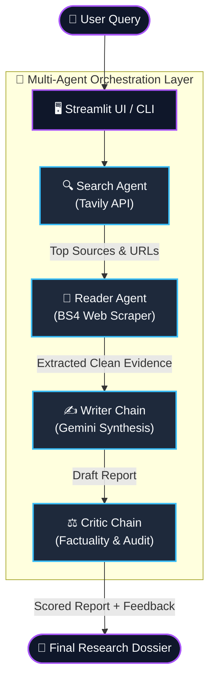

<div align="center">

# 🔬 ResearchMind: Autonomous Multi-Agent Research System

**An intelligent, multi-agent AI research pipeline powered by LangChain, Google Gemini, Tavily, and Streamlit.**

[](https://www.python.org/)
[](https://www.langchain.com/)
[](https://aistudio.google.com/)
[](https://tavily.com/)
[](https://streamlit.io/)
[](https://opensource.org/licenses/MIT)

</div>

---

## 📌 Overview

**ResearchMind** is an end-to-end autonomous research assistant that investigates complex topics by orchestrating specialized AI agents. Rather than relying on a single prompt that may hallucinate or produce surface-level answers, ResearchMind divides the research lifecycle across specialized roles: finding trusted sources, scraping deep web content, synthesizing structured reports, and applying adversarial critique.

### Key Capabilities
- 🌐 **Targeted Web Retrieval:** Queries live web intelligence using the Tavily Search API.
- 📑 **Deep Page Extraction:** Automated scraper extracts high-density text while stripping boilerplate (scripts, ads, nav elements).
- ✍️ **Structured Report Synthesis:** Produces publication-ready reports with citations, key findings, and balanced conclusions.
- ⚖️ **Adversarial Critic & Grading:** Automatically grades the report (1–10), flagging unsupported claims, gaps, and areas for improvement.
- 💻 **Dual Interface:** Run interactively via a modern **Streamlit UI** or programmatically via a **CLI pipeline**.

---

## 🏗️ System Architecture



---

## 🤖 Agents Breakdown

| Agent / Chain | Engine | Primary Responsibility |
| :--- | :--- | :--- |
| **Search Agent** | `Tavily + Gemini` | Formulates targeted queries and gathers top ranking, credible source URLs. |
| **Reader Agent** | `BeautifulSoup + Requests` | Scrapes target URLs, sanitizes HTML tree, and extracts core evidence. |
| **Writer Chain** | `LangChain + Gemini` | Synthesizes gathered data into a structured report with grounded citations. |
| **Critic Chain** | `LangChain + Gemini` | Conducts a strict review: scores quality out of 10, identifies strengths, and flags weaknesses. |

---

## 📂 Project Structure

```text
reseachers/
├── app.py                 # Streamlit web dashboard with interactive research studio
├── pipeline.py            # CLI pipeline orchestrator for terminal execution
├── agents.py              # Agent definitions (Search, Reader, Writer, Critic)
├── tools.py               # Custom tools (Tavily search and BS4 URL scraper)
├── requirements.txt       # Project dependencies
├── .env.example           # Template for required environment variables
├── .gitignore             # Ignored directories, secrets, and cache files
└── README.md              # Project documentation and architecture guide
```

---

## 🚀 Quick Start

### 1. Clone the Repository
```bash
git clone https://github.com/your-username/reseachers.git
cd reseachers
```

### 2. Set Up a Virtual Environment
```bash
# Windows
python -m venv .venv
.venv\Scripts\activate

# macOS / Linux
python3 -m venv .venv
source .venv/bin/activate
```

### 3. Install Dependencies
```bash
pip install -r requirements.txt
```

### 4. Configure Environment Variables
Create a `.env` file in the root directory (or copy `.env.example`):
```bash
cp .env.example .env
```
Fill in your API credentials:
```env
GEMINI_API_KEY="your_google_gemini_api_key"
TAVILY_API_KEY="your_tavily_api_key"
```
> **Get Keys:**
> - [Google AI Studio](https://aistudio.google.com/) (Gemini API)
> - [Tavily AI](https://tavily.com/) (Search API)

---

## 💻 Running the Application

### Option A: Interactive Web App (Streamlit)
```bash
streamlit run app.py
```
Open your browser at `http://localhost:8501` to use the research dashboard.

### Option B: Terminal Pipeline (CLI)
```bash
python pipeline.py
```
Enter a research topic when prompted to watch the pipeline execute across all 4 steps in real time.

---

## 🧠 Engineering Decisions & Trade-offs

1. **Separation of Concerns:**
   - LLMs can struggle when tasked with searching, scraping, synthesizing, and quality-checking in a single prompt. Dividing duties into specialized agents prevents context overflow and produces higher quality outputs.
2. **Noise Reduction via Sanitized Scraping:**
   - Raw HTML from the web contains navigation links, scripts, and styling noise. The reader tool cleans headers and structural elements to keep context windows dense with factual text.
3. **Adversarial Factuality Check:**
   - By feeding the generated draft into a dedicated Critic chain, the system reduces hallucinations and alerts the user whenever a claim lacks verifiable evidence.

---

## 📬 Contact & Connect

- **Author:** Sharad Pratap Singh
- **GitHub:** [@your-github-username](https://github.com/)
- **LinkedIn:** [Sharad Pratap Singh](https://linkedin.com/)

*(Feel free to star ⭐ the repository if you found this project insightful!)*
